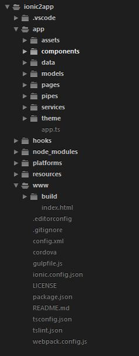

#Ionic2-benchmark

##1- Ionic 2 Project Structure:

  
* **config.xml** : This contains configurations like the app name, and the package name, that will be used to install our app into an actual device.

* **cordova** :

* **hooks** : These scripts run as part of the Cordova build process. If you need to customize that in any way, then do it here.
  
* **ionic.config.json** : These are your project-specific settings. Primarily it’s just the app name and id along with any proxies you may need for your app.
  
* **node_modules** - Contains the npm packages listed in the package.json file. These are packages necessary for building the ionic app.

* **package.json** : If you are familiar with npm, you will recognize this immediately. If not, then this file describes your app’s production and development dependencies.

* **platforms** : This is where platform specific builds, build tools and packages/libraries are stored. You will find a folder for the platform your are building on. To add a platform, android for example, simply run ionic platform add android, and this will add the folder android folder to this folder.

* **plugins** : This is where cordova plugins will be stored when they are installed. Cordova plugins enables your app to have native functionality in the mobile device, e.g accessing the media storage of the device, or even the bluetooth API.
  
* **resources** : This also contains platform specific resources, such as icons and splash screens.
  
* **tsconfig.json**: N/A
  
* **tslint.json**: N/A

* **/webpack.config.js** : (optional) If you are using webpack for builds then you certainly will need this for adjusting your webpack build settings. If you are not using webpack then, please move on… nothing to see here.

* **/gulpfile.js** : Here you find hooks for modifying the Ionic gulp tasks. Use these to modify the Ionic build. There are a number of custom hooks you can take advantage of. You most likely will not need to modify this file.

* **/app** : Starting with folders, we can see that the bulk of our app lives here: pages, services, etc.

* **/app/pages** : This folder is containing all pages of your application. Within pages you’ll again find subfolders. Each page is implemented as an Angular 2 component (you’ll learn more about Angular 2 components later on). As each component implementation can consist of multiple files, the files belonging to one component are kept in one subfolder of app/pages. For instance, in the initial project structure you can find a folder app/pages/home which contains three files: home.js, home.html and home.scss. All these files belong to the home page of the app. home.js contains the implementation of the corresponding class HomePage. The template code for the HomePage component is stored in home.html and SCSS styling is for that template is available in home.scss.

* **/app/themes** : This folder will contain all SCSS files which contain styling on application level. If you take a look into that folder you’ll find a core SCSS file as well as platform specific SCSS files. Another SCSS file is containing SCSS variables

* **/app/app.js or app.ts** : Finally some code! This is where we bootstrap our application and where you will find your app’s @App decorator. There are a handful of global settings you’ll want to pass in. Most importantly, you’ll want to pass your app’s root template, config and list of providers.

* **www**: This is where your index.html file lives. However, don’t be fooled into thinking this is where your app should live. Put all of your application scripts in the ./app folder.

* **www/index.html**: This is obviously where you should update your meta tags and add in any required scripts (cordova, polyfills, vendor build, app build, etc.).
  
